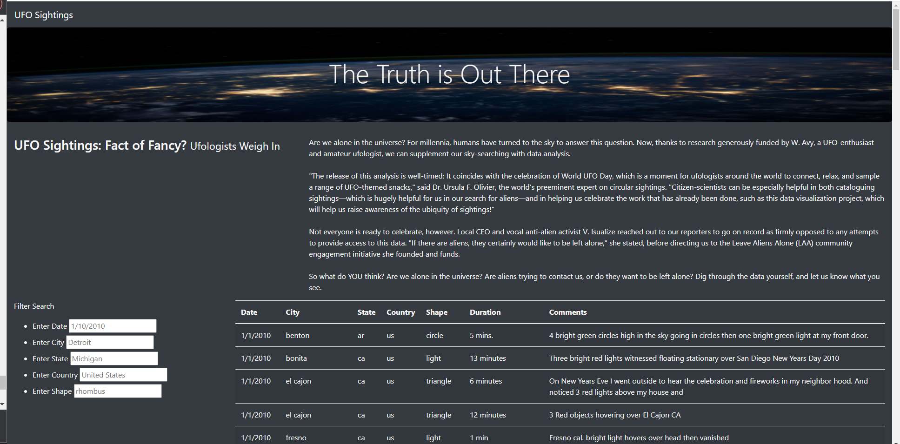
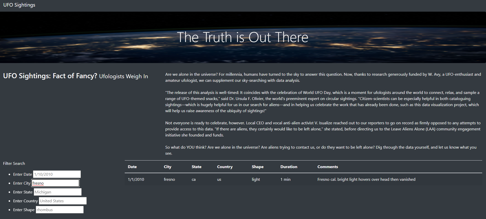

# UFOs
## Overview of UFOs Project
The Unidentified flying object (UFO) analysis project is used to create an interactive website that parses UFO data using five filters. The filters available include: Date, City, State, Country, and Shape. To create the webpage HTML and Javascript were utilized to develop the dynamics of the data.
## Results
This webpage is dynamic and used to filter through the hundreds (if not thousands) of UFO sightings throughout the world. To take advantage of this functionality, there are five filters in the left margin to find relevant UFO data.  

Each filter is identified in the title and provides an example of the data that could be used to generate the search results.  See the 'Enter City' line of the screenshot below for an example of the filter at work. 

In order to remove the previously searched filtered, you delete the text within the current filters and press the enter key. After removing the text then you will return back to the main page with all available data.
## Summary
The drawback of this method is that spelling must be correct to return the data that is being requested. Two recommendations that could help further development is by editing the code to account for approximate matches and to allow photos evidence of the UFO sightings to allow evidence to gain trust with the users.
